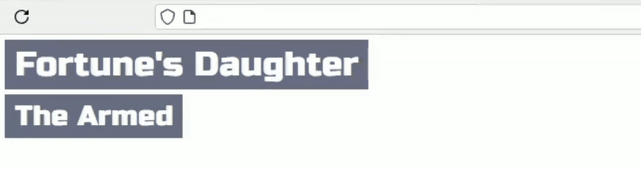

## Configuration

1.  Go to the [Spotify Developer Dashboard](https://developer.spotify.com/dashboard/create) and create a new application.

2.  Set the "Redirect URI" to `http://127.0.0.1:8888/callback`.

3.  Copy your "Client ID" and "Client Secret".

4.  Open `config.ini` and replace `CLIENT_ID` and `CLIENT_SECRET` with your credentials.

5.  In OBS add overlay as a browser with `http://127.0.0.1:8888` url

6.  To Auth use **Custom Browser Docks** (Docks->Custom Browser Docks) with url `http://127.0.0.1:8888/login`